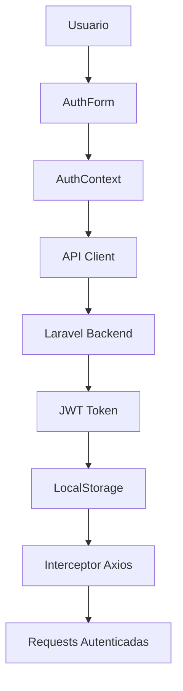

# 🔐 Frontend Authentication Implementation

## Índice
1. [Arquitectura de Autenticación](#arquitectura-de-autenticación)
2. [Implementación del Cliente API](#implementación-del-cliente-api)
3. [Sistema de Roles y Permisos](#sistema-de-roles-y-permisos)
4. [Contexto de Autenticación](#contexto-de-autenticación)
5. [Componentes de Autenticación](#componentes-de-autenticación)
6. [Guards y Protección de Rutas](#guards-y-protección-de-rutas)
7. [Sistema de Niveles y XP (Propuesta v2)](#sistema-de-niveles-y-xp-propuesta-v2)
8. [Configuración y Uso](#configuración-y-uso)
9. [Consideraciones de Seguridad](#consideraciones-de-seguridad)

---

## Arquitectura de Autenticación

### Flujo General


### Tecnologías Utilizadas
- **React Context API** - Manejo de estado global
- **Axios Interceptors** - Automático manejo de tokens
- **LocalStorage** - Persistencia de sesión
- **TypeScript** - Tipado estricto
- **Bearer Token** - Autenticación JWT

---

## Implementación del Cliente API

### Configuración Base (`api/client.ts`)
```typescript
// Configuración del cliente axios con interceptores automáticos
export const apiClient: AxiosInstance = axios.create({
  baseURL: 'http://localhost:8000/api/v1',
  timeout: 10000,
  headers: {
    'Content-Type': 'application/json',
    'Accept': 'application/json',
  },
});

// Manejo automático de tokens
export const setAuthToken = (token: string) => {
  apiClient.defaults.headers.common['Authorization'] = `Bearer ${token}`;
  localStorage.setItem('auth_token', token);
};

// Interceptor para manejo de errores 401/403
apiClient.interceptors.response.use(
  (response) => response,
  (error) => {
    if (error.response?.status === 401) {
      removeAuthToken();
      window.location.href = '/login';
    }
    return Promise.reject(transformError(error));
  }
);
```

### Servicios de Autenticación (`api/auth.ts`)
```typescript
export const authService = {
  // POST /api/v1/auth/login
  login: async (credentials: LoginRequest): Promise<AuthResponse> => {
    return apiCall<AuthResponse>({
      method: 'POST',
      url: '/auth/login',
      data: credentials,
    });
  },

  // POST /api/v1/auth/register  
  register: async (userData: RegisterRequest): Promise<AuthResponse> => {
    return apiCall<AuthResponse>({
      method: 'POST',
      url: '/auth/register', 
      data: userData,
    });
  },

  // POST /api/v1/auth/logout
  logout: async (): Promise<LogoutResponse> => {
    return apiCall<LogoutResponse>({
      method: 'POST',
      url: '/auth/logout',
    });
  },

  // GET /api/v1/auth/me
  me: async (): Promise<User> => {
    return apiCall<User>({
      method: 'GET',
      url: '/auth/me',
    });
  }
};
```

---

## Sistema de Roles y Permisos

### Jerarquía de Roles
```typescript
// Jerarquía: Admin > Moderator > User
const roleHierarchy: Record<UserRole, number> = {
  'User': 1,
  'Moderator': 2, 
  'Admin': 3,
};
```

### Matriz de Permisos
| Acción | User | Moderator | Admin |
|--------|------|-----------|-------|
| Crear Disciplinas | ✅ | ✅ | ✅ |
| Editar Propias Disciplinas | ✅ | ❌ | ❌ |
| Editar Cualquier Disciplina | ❌ | ✅ | ✅ |
| Ver Estadísticas Usuarios | ❌ | ✅ | ✅ |
| Gestionar Usuarios | ❌ | ✅ | ✅ |
| Eliminar Usuarios | ❌ | ❌ | ✅ |
| Panel Administración | ❌ | ❌ | ✅ |

### Hook de Roles (`hooks/useRole.ts`)
```typescript
export const useRole = () => {
  const { user, isAuthenticated } = useAuth();
  
  const hasMinimumRole = (requiredRole: UserRole): boolean => {
    if (!isAuthenticated || !user?.role) return false;
    return roleHierarchy[user.role] >= roleHierarchy[requiredRole];
  };

  const permissions: RolePermissions = {
    canCreateDisciplines: hasMinimumRole('User'),
    canEditDisciplines: user?.role === 'Admin' || user?.role === 'Moderator',
    canViewUserStats: hasMinimumRole('Moderator'),
    canManageUsers: hasMinimumRole('Moderator'),
    canDeleteUsers: hasMinimumRole('Admin'),
    canViewAdminPanel: hasMinimumRole('Admin'),
  };

  return { user, permissions, hasMinimumRole };
};
```

---

## Contexto de Autenticación

### AuthProvider (`contexts/AuthContext.tsx`)
```typescript
export const AuthProvider: React.FC<AuthProviderProps> = ({ children }) => {
  const [user, setUser] = useState<User | null>(null);
  const [token, setToken] = useState<string | null>(null);
  const [isLoading, setIsLoading] = useState(true);

  // Inicialización automática de sesión
  useEffect(() => {
    const initializeAuth = async () => {
      const savedToken = getAuthToken();
      if (savedToken) {
        try {
          const userData = await authService.me();
          setUser(userData);
          setToken(savedToken);
        } catch (error) {
          removeAuthToken(); // Token inválido
        }
      }
      setIsLoading(false);
    };
    initializeAuth();
  }, []);

  const login = async (credentials: LoginRequest): Promise<void> => {
    const response = await authService.login(credentials);
    setAuthToken(response.access_token);
    setUser(response.user);
    setToken(response.access_token);
  };

  const logout = async (): Promise<void> => {
    try {
      if (isAuthenticated) await authService.logout();
    } finally {
      removeAuthToken();
      setUser(null);
      setToken(null);
    }
  };

  return (
    <AuthContext.Provider value={{
      user, token, isLoading, isAuthenticated: !!user && !!token,
      login, logout, register, refreshToken, updateUser
    }}>
      {children}
    </AuthContext.Provider>
  );
};
```

---

## Componentes de Autenticación

### AuthForm (`components/Auth/AuthForm.tsx`)
```typescript
export const AuthForm: React.FC<AuthFormProps> = ({ onSuccess }) => {
  const { login, register, isLoading } = useAuth();
  const [isLoginMode, setIsLoginMode] = useState(true);
  const [formData, setFormData] = useState({
    name: '', email: '', password: '', password_confirmation: ''
  });

  const handleSubmit = async (e: React.FormEvent) => {
    e.preventDefault();
    try {
      if (isLoginMode) {
        await login({ email: formData.email, password: formData.password });
      } else {
        await register(formData);
      }
      onSuccess?.();
    } catch (error) {
      setError(error.message);
    }
  };

  return (
    <form onSubmit={handleSubmit}>
      {/* Campos dinámicos según modo login/register */}
      <button type="submit" disabled={isLoading}>
        {isLoading ? 'Procesando...' : (isLoginMode ? 'Iniciar Sesión' : 'Registrarse')}
      </button>
    </form>
  );
};
```

### RoleBadge (`components/RoleBadge/RoleBadge.tsx`)
```typescript
export const RoleBadge: React.FC<RoleBadgeProps> = ({ size = 'medium' }) => {
  const { userRole } = useRole();
  
  const getRoleConfig = (role: string) => {
    switch (role) {
      case 'Admin': return { icon: '👑', text: 'Admin', className: 'role-admin' };
      case 'Moderator': return { icon: '🛡️', text: 'Moderator', className: 'role-moderator' };
      case 'User': return { icon: '👤', text: 'User', className: 'role-user' };
    }
  };

  const config = getRoleConfig(userRole);
  return (
    <div className={`role-badge role-badge-${size} ${config.className}`}>
      <span className="role-icon">{config.icon}</span>
      <span className="role-text">{config.text}</span>
    </div>
  );
};
```

---

## Guards y Protección de Rutas

### RoleGuard (`components/RoleGuard/RoleGuard.tsx`)
```typescript
export const RoleGuard: React.FC<RoleGuardProps> = ({
  children, allowedRoles, minimumRole, requireAuth = true, fallback = null
}) => {
  const { userRole, isAuthenticated, hasMinimumRole } = useRole();

  if (requireAuth && !isAuthenticated) return fallback;
  if (allowedRoles && userRole && !allowedRoles.includes(userRole)) return fallback;
  if (minimumRole && !hasMinimumRole(minimumRole)) return fallback;

  return children;
};

// Componentes especializados
export const AdminOnly: React.FC = ({ children, fallback }) => (
  <RoleGuard allowedRoles={['Admin']} fallback={fallback}>
    {children}
  </RoleGuard>
);

export const ModeratorPlus: React.FC = ({ children, fallback }) => (
  <RoleGuard minimumRole="Moderator" fallback={fallback}>
    {children}
  </RoleGuard>
);
```

### Uso en Componentes
```typescript
// Sidebar con secciones condicionales
<ModeratorPlus>
  <div className="nav-section">
    <h3>Moderación</h3>
    <NavItem icon="🛡️" label="Panel Moderación" />
    <NavItem icon="📋" label="Reportes" />
  </div>
</ModeratorPlus>

<AdminOnly>
  <div className="nav-section">
    <h3>Administración</h3>
    <NavItem icon="👑" label="Panel Admin" />
    <NavItem icon="👥" label="Gestión Usuarios" />
  </div>
</AdminOnly>
```

---

## Sistema de Niveles y XP (Propuesta v2)

### 🎯 Análisis del Sistema Actual (Mock-up)

En el mock-up actual se implementa un sistema básico de niveles y experiencia:

```typescript
// Sistema actual en el Header
const userLevel = 12;
const userXp = 2450;
const maxXp = 3000;
const progressPercentage = (userXp / maxXp) * 100;

// Visualización en UI
<div className="user-level">
  <span className="level-text">Nivel {userLevel}</span>
  <div className="xp-bar">
    <div className="xp-fill" style={{ width: `${progressPercentage}%` }}></div>
  </div>
  <span className="xp-text">{userXp}/{maxXp} XP</span>
</div>
```

### 📊 Propuesta de Implementación Backend v2

#### Nuevas Tablas de Base de Datos
```sql
-- Tabla de niveles del usuario
CREATE TABLE user_levels (
    id BIGINT UNSIGNED AUTO_INCREMENT PRIMARY KEY,
    user_id BIGINT UNSIGNED NOT NULL,
    current_level INT DEFAULT 1,
    current_xp INT DEFAULT 0,
    total_xp INT DEFAULT 0,
    created_at TIMESTAMP NULL DEFAULT NULL,
    updated_at TIMESTAMP NULL DEFAULT NULL,
    FOREIGN KEY (user_id) REFERENCES users(id) ON DELETE CASCADE,
    UNIQUE KEY unique_user_level (user_id)
);

-- Tabla de configuración de niveles
CREATE TABLE level_config (
    id BIGINT UNSIGNED AUTO_INCREMENT PRIMARY KEY,
    level INT UNIQUE NOT NULL,
    xp_required INT NOT NULL, -- XP total necesario para alcanzar este nivel
    xp_for_next INT NOT NULL, -- XP necesario desde el nivel anterior
    rewards JSON NULL, -- Recompensas por alcanzar el nivel
    created_at TIMESTAMP NULL DEFAULT NULL,
    updated_at TIMESTAMP NULL DEFAULT NULL
);

-- Tabla de acciones que otorgan XP
CREATE TABLE xp_actions (
    id BIGINT UNSIGNED AUTO_INCREMENT PRIMARY KEY,
    action_name VARCHAR(100) NOT NULL UNIQUE,
    xp_reward INT NOT NULL,
    daily_limit INT NULL, -- Límite diario de veces que se puede ganar XP por esta acción
    description TEXT,
    is_active BOOLEAN DEFAULT TRUE,
    created_at TIMESTAMP NULL DEFAULT NULL,
    updated_at TIMESTAMP NULL DEFAULT NULL
);

-- Tabla de historial de XP ganado
CREATE TABLE xp_history (
    id BIGINT UNSIGNED AUTO_INCREMENT PRIMARY KEY,
    user_id BIGINT UNSIGNED NOT NULL,
    action_name VARCHAR(100) NOT NULL,
    xp_gained INT NOT NULL,
    reference_id INT NULL, -- ID de la actividad/disciplina relacionada
    reference_type VARCHAR(50) NULL, -- 'activity', 'discipline', etc.
    earned_at TIMESTAMP DEFAULT CURRENT_TIMESTAMP,
    FOREIGN KEY (user_id) REFERENCES users(id) ON DELETE CASCADE,
    FOREIGN KEY (action_name) REFERENCES xp_actions(action_name) ON DELETE CASCADE
);
```

#### Configuración Inicial de Niveles
```sql
-- Insertar configuración de niveles (progresión exponencial)
INSERT INTO level_config (level, xp_required, xp_for_next) VALUES
(1, 0, 100),
(2, 100, 150),
(3, 250, 200),
(4, 450, 300),
(5, 750, 400),
(10, 3500, 800),
(15, 8000, 1200),
(20, 15000, 1500),
(25, 25000, 2000),
(30, 40000, 2500);

-- Insertar acciones que otorgan XP
INSERT INTO xp_actions (action_name, xp_reward, daily_limit, description) VALUES
('complete_activity', 10, NULL, 'Completar una actividad física'),
('create_discipline', 25, 3, 'Crear una nueva disciplina'),
('daily_login', 5, 1, 'Iniciar sesión diariamente'),
('weekly_goal', 100, 1, 'Completar objetivo semanal'),
('monthly_challenge', 500, 1, 'Completar desafío mensual'),
('share_activity', 15, 5, 'Compartir actividad con la comunidad'),
('help_newcomer', 30, 3, 'Ayudar a un usuario nuevo');
```

#### Modelos Laravel
```php
// app/Models/UserLevel.php
class UserLevel extends Model
{
    protected $fillable = ['user_id', 'current_level', 'current_xp', 'total_xp'];
    
    public function user()
    {
        return $this->belongsTo(User::class);
    }
    
    public function calculateLevel(): array
    {
        $config = LevelConfig::where('xp_required', '<=', $this->total_xp)
                            ->orderBy('level', 'desc')
                            ->first();
        
        $nextLevel = LevelConfig::where('level', $config->level + 1)->first();
        
        return [
            'current_level' => $config->level,
            'current_xp' => $this->total_xp - $config->xp_required,
            'xp_for_next' => $nextLevel ? $nextLevel->xp_for_next : 0,
            'total_xp' => $this->total_xp
        ];
    }
}

// app/Models/XpAction.php
class XpAction extends Model
{
    protected $fillable = ['action_name', 'xp_reward', 'daily_limit', 'description', 'is_active'];
    
    public function canEarnXp(User $user): bool
    {
        if (!$this->is_active) return false;
        
        if ($this->daily_limit) {
            $todayCount = XpHistory::where('user_id', $user->id)
                                  ->where('action_name', $this->action_name)
                                  ->whereDate('earned_at', today())
                                  ->count();
            return $todayCount < $this->daily_limit;
        }
        
        return true;
    }
}
```

#### Service para Gestión de XP
```php
// app/Services/XpService.php
class XpService
{
    public function awardXp(User $user, string $actionName, ?int $referenceId = null, ?string $referenceType = null): bool
    {
        $action = XpAction::where('action_name', $actionName)->first();
        
        if (!$action || !$action->canEarnXp($user)) {
            return false;
        }
        
        // Crear registro en historial
        XpHistory::create([
            'user_id' => $user->id,
            'action_name' => $actionName,
            'xp_gained' => $action->xp_reward,
            'reference_id' => $referenceId,
            'reference_type' => $referenceType,
        ]);
        
        // Actualizar nivel del usuario
        $userLevel = UserLevel::firstOrCreate(['user_id' => $user->id]);
        $userLevel->total_xp += $action->xp_reward;
        
        $levelData = $userLevel->calculateLevel();
        $userLevel->current_level = $levelData['current_level'];
        $userLevel->current_xp = $levelData['current_xp'];
        $userLevel->save();
        
        // Disparar evento si subió de nivel
        if ($userLevel->current_level > $userLevel->getOriginal('current_level')) {
            event(new UserLevelUp($user, $userLevel->current_level));
        }
        
        return true;
    }
    
    public function getUserLevelData(User $user): array
    {
        $userLevel = UserLevel::where('user_id', $user->id)->first();
        
        if (!$userLevel) {
            return [
                'current_level' => 1,
                'current_xp' => 0,
                'xp_for_next' => 100,
                'total_xp' => 0,
                'progress_percentage' => 0
            ];
        }
        
        $levelData = $userLevel->calculateLevel();
        $levelData['progress_percentage'] = $levelData['xp_for_next'] > 0 
            ? ($levelData['current_xp'] / $levelData['xp_for_next']) * 100 
            : 100;
            
        return $levelData;
    }
}
```

#### Controllers para API
```php
// app/Http/Controllers/Api/UserLevelController.php
class UserLevelController extends Controller
{
    public function __construct(private XpService $xpService) {}
    
    public function getUserLevel(User $user)
    {
        return response()->json([
            'data' => $this->xpService->getUserLevelData($user)
        ]);
    }
    
    public function getXpHistory(User $user)
    {
        $history = XpHistory::where('user_id', $user->id)
                           ->with('action')
                           ->orderBy('earned_at', 'desc')
                           ->paginate(20);
                           
        return response()->json($history);
    }
    
    public function getLeaderboard()
    {
        $leaderboard = UserLevel::with('user:id,name')
                               ->orderBy('total_xp', 'desc')
                               ->limit(100)
                               ->get();
                               
        return response()->json(['data' => $leaderboard]);
    }
}
```

### 🎮 Integración Frontend v2

#### Nuevos Tipos TypeScript
```typescript
// api/types.ts - Nuevos tipos para XP/Niveles
export interface UserLevel {
  current_level: number;
  current_xp: number;
  xp_for_next: number;
  total_xp: number;
  progress_percentage: number;
}

export interface XpHistoryItem {
  id: number;
  action_name: string;
  xp_gained: number;
  reference_id?: number;
  reference_type?: string;
  earned_at: string;
}

export interface LeaderboardEntry {
  user: {
    id: number;
    name: string;
  };
  total_xp: number;
  current_level: number;
}
```

#### Hook para Niveles
```typescript
// hooks/useUserLevel.ts
export const useUserLevel = () => {
  const { user } = useAuth();
  
  const { data: levelData, isLoading, refetch } = useQuery({
    queryKey: ['userLevel', user?.id],
    queryFn: () => userLevelService.getUserLevel(user!.id),
    enabled: !!user,
    staleTime: 1 * 60 * 1000, // 1 minuto
  });

  const { data: xpHistory } = useQuery({
    queryKey: ['xpHistory', user?.id],
    queryFn: () => userLevelService.getXpHistory(user!.id),
    enabled: !!user,
  });

  return {
    levelData: levelData?.data,
    xpHistory: xpHistory?.data,
    isLoading,
    refetch
  };
};
```

#### Componente de Niveles Mejorado
```typescript
// components/UserLevel/UserLevelDisplay.tsx
export const UserLevelDisplay: React.FC = () => {
  const { levelData, isLoading } = useUserLevel();
  
  if (isLoading || !levelData) {
    return <div className="level-skeleton">Cargando nivel...</div>;
  }

  return (
    <div className="user-level-display">
      <div className="level-info">
        <span className="level-number">{levelData.current_level}</span>
        <span className="level-label">Nivel</span>
      </div>
      
      <div className="xp-progress">
        <div className="xp-bar">
          <div 
            className="xp-fill" 
            style={{ width: `${levelData.progress_percentage}%` }}
          />
        </div>
        <span className="xp-text">
          {levelData.current_xp} / {levelData.xp_for_next} XP
        </span>
      </div>
      
      <div className="total-xp">
        Total: {levelData.total_xp.toLocaleString()} XP
      </div>
    </div>
  );
};
```

### 🔗 Código para Comentar Temporalmente

Para evitar conflictos durante la transición al sistema real, estos elementos del mock-up deben comentarse:

```typescript
// components/Layout/Header.tsx
const Header: React.FC = () => {
  // ⚠️ COMENTAR TEMPORALMENTE - Reemplazar con useUserLevel cuando esté la API v2
  /*
  const userLevel = 12;
  const userXp = 2450;
  const maxXp = 3000;
  const progressPercentage = (userXp / maxXp) * 100;
  */
  
  // ✅ IMPLEMENTACIÓN FUTURA
  // const { levelData } = useUserLevel();
  
  return (
    // ⚠️ COMENTAR SECCIÓN DE NIVELES TEMPORALMENTE
    /*
    <div className="user-level">
      <span className="level-text">Nivel {userLevel}</span>
      <div className="xp-bar">
        <div className="xp-fill" style={{ width: `${progressPercentage}%` }}></div>
      </div>
      <span className="xp-text">{userXp}/{maxXp} XP</span>
    </div>
    */
    
    // ✅ REEMPLAZAR CON:
    // <UserLevelDisplay />
  );
};
```

### 📋 Endpoints API v2 Propuestos

```typescript
// api/userLevel.ts
export const userLevelService = {
  // GET /api/v1/users/{id}/level
  getUserLevel: async (userId: number): Promise<ApiResponse<UserLevel>> => {
    return apiCall<ApiResponse<UserLevel>>({
      method: 'GET',
      url: `/users/${userId}/level`,
    });
  },

  // GET /api/v1/users/{id}/xp-history
  getXpHistory: async (userId: number): Promise<PaginatedResponse<XpHistoryItem>> => {
    return apiCall<PaginatedResponse<XpHistoryItem>>({
      method: 'GET',
      url: `/users/${userId}/xp-history`,
    });
  },

  // GET /api/v1/leaderboard
  getLeaderboard: async (): Promise<ApiResponse<LeaderboardEntry[]>> => {
    return apiCall<ApiResponse<LeaderboardEntry[]>>({
      method: 'GET',
      url: '/leaderboard',
    });
  },

  // POST /api/v1/users/{id}/award-xp (Admin only)
  awardXp: async (userId: number, actionName: string): Promise<ApiResponse<UserLevel>> => {
    return apiCall<ApiResponse<UserLevel>>({
      method: 'POST',
      url: `/users/${userId}/award-xp`,
      data: { action_name: actionName },
    });
  },
};
```

---

## Configuración y Uso

### Instalación de Dependencias
```bash
npm install @tanstack/react-query @tanstack/react-query-devtools axios
```

### Configuración en App.tsx
```typescript
function App() {
  return (
    <ApiProvider>
      <ThemeProvider>
        <AuthProvider>
          <Layout>
            <Dashboard />
          </Layout>
        </AuthProvider>
      </ThemeProvider>
    </ApiProvider>
  );
}
```

### Variables de Entorno
```env
REACT_APP_API_BASE_URL=http://localhost:8000/api/v1
REACT_APP_TOKEN_DURATION=15 # días
```

---

## ❓ Consultas Requeridas al Backend

### 🔄 Refresh Token Strategy

**IMPORTANTE**: Antes de implementar en producción, **consultar al equipo de backend** sobre:

#### 1. ¿Existe endpoint de refresh token?
```bash
# Verificar si existe en la API actual:
GET /api/v1/auth/refresh
POST /api/v1/auth/refresh
```

**Si SÍ existe refresh token:**
```typescript
// Actualizar authService con refresh endpoint
export const authService = {
  // ... servicios existentes ...
  
  // POST /api/v1/auth/refresh
  refresh: async (): Promise<AuthResponse> => {
    return apiCall<AuthResponse>({
      method: 'POST',
      url: '/auth/refresh',
    });
  },
};

// Implementar refresh automático en interceptor
let isRefreshing = false;
let failedQueue: Array<{resolve: Function, reject: Function}> = [];

apiClient.interceptors.response.use(
  (response) => response,
  async (error) => {
    const originalRequest = error.config;
    
    if (error.response?.status === 401 && !originalRequest._retry) {
      if (isRefreshing) {
        // Si ya se está refrescando, encolar la petición
        return new Promise((resolve, reject) => {
          failedQueue.push({ resolve, reject });
        }).then(token => {
          originalRequest.headers['Authorization'] = `Bearer ${token}`;
          return apiClient(originalRequest);
        });
      }
      
      originalRequest._retry = true;
      isRefreshing = true;
      
      try {
        const refreshResponse = await authService.refresh();
        const newToken = refreshResponse.access_token;
        setAuthToken(newToken);
        
        // Procesar cola de peticiones fallidas
        failedQueue.forEach(({ resolve }) => resolve(newToken));
        failedQueue = [];
        
        originalRequest.headers['Authorization'] = `Bearer ${newToken}`;
        return apiClient(originalRequest);
      } catch (refreshError) {
        // Refresh falló, logout automático
        removeAuthToken();
        window.location.href = '/login';
        return Promise.reject(refreshError);
      } finally {
        isRefreshing = false;
      }
    }
    
    return Promise.reject(error);
  }
);
```

**Si NO existe refresh token:**

#### Opción A: Re-login Automático
```typescript
// Implementar re-login silencioso si se guardan credenciales
const performSilentLogin = async () => {
  const savedCredentials = getSecureCredentials(); // Implementar storage seguro
  if (savedCredentials) {
    try {
      await authService.login(savedCredentials);
      return true;
    } catch (error) {
      removeSecureCredentials();
      return false;
    }
  }
  return false;
};

// En interceptor 401
if (error.response?.status === 401) {
  const reloginSuccess = await performSilentLogin();
  if (reloginSuccess) {
    return apiClient(originalRequest);
  } else {
    removeAuthToken();
    window.location.href = '/login';
  }
}
```

#### Opción B: Solicitar Endpoint Custom
```typescript
// Proponer al backend endpoint de extensión de sesión
// POST /api/v1/auth/extend-session
extend: async (): Promise<AuthResponse> => {
  return apiCall<AuthResponse>({
    method: 'POST',
    url: '/auth/extend-session',
  });
}
```

### 🤝 Otras Consultas Críticas al Backend

#### 2. Duración exacta del token
```bash
# Preguntar al backend:
# - ¿Cuánto dura el access_token? (documentación dice 15 días)
# - ¿Se puede consultar tiempo restante del token?
# - ¿Hay warning headers antes de expiración?
```

#### 3. Estructura del JWT
```bash
# Verificar si el JWT contiene:
# - Roles del usuario (para validación local)
# - Timestamp de expiración
# - ID del usuario
# - Permisos específicos
```

#### 4. Rate Limiting
```bash
# Consultar límites de la API:
# - ¿Hay rate limiting en /auth/login?
# - ¿Cuántos intentos fallidos antes de bloqueo?
# - ¿Hay headers de rate limit en respuestas?
```

#### 5. Endpoints de Logout
```bash
# Verificar comportamiento:
# - ¿POST /auth/logout invalida el token en servidor?
# - ¿Es necesario el logout si el token expira?
# - ¿Hay logout global (todas las sesiones)?
```

### 📋 Checklist de Consultas Backend

- [ ] **Refresh Token**: ¿Existe endpoint? ¿Cómo funciona?
- [ ] **Token Duration**: ¿15 días confirmado? ¿Variable?
- [ ] **JWT Structure**: ¿Qué claims contiene?
- [ ] **Rate Limiting**: ¿Límites en auth endpoints?
- [ ] **Logout Behavior**: ¿Invalidación server-side?
- [ ] **Session Timeout**: ¿Timeout por inactividad?
- [ ] **Multi-device Login**: ¿Se permite? ¿Límites?
- [ ] **Password Reset**: ¿Endpoints disponibles?
- [ ] **Email Verification**: ¿Obligatorio? ¿Endpoints?
- [ ] **2FA Support**: ¿Planeado? ¿Implementado?

---

## Consideraciones de Seguridad

### ✅ Implementaciones de Seguridad
- **Interceptores automáticos** para manejo de tokens expirados
- **Redirección automática** en errores 401/403
- **Validación de tokens** en cada inicio de aplicación
- **Limpieza automática** de localStorage en logout
- **Retry inteligente** que no reintenta en errores de autenticación

### ⚠️ Recomendaciones Adicionales
- Implementar **refresh token** automático antes de expiración (consultar backend)
- Añadir **timeout de sesión** por inactividad
- Considerar **CSP headers** para prevenir XSS
- Implementar **rate limiting** en formularios de login
- Añadir **captcha** después de múltiples intentos fallidos

### 🔐 Flujo de Seguridad Token (Según Backend)

#### Escenario A: Con Refresh Token
1. **Login exitoso** → Access token + refresh token almacenados
2. **Cada request** → Interceptor añade Bearer token automáticamente  
3. **Token expira** → Interceptor detecta 401 → Refresh automático
4. **Refresh exitoso** → Continúa con request original
5. **Refresh falla** → Logout automático y redirección

#### Escenario B: Sin Refresh Token
1. **Login exitoso** → Token almacenado en localStorage + axios headers
2. **Cada request** → Interceptor añade Bearer token automáticamente  
3. **Token inválido/expirado** → Interceptor detecta 401 → Logout automático
4. **Usuario debe re-autenticarse** → Formulario de login
5. **Logout** → Limpieza completa de tokens y redirección

### 🛡️ Implementación Defensiva

```typescript
// Configuración flexible basada en capabilities del backend
const AUTH_CONFIG = {
  // Configuración actual
  HAS_REFRESH_TOKEN: false, // ⚠️ Actualizar según backend
  TOKEN_DURATION_DAYS: 15,  // ⚠️ Confirmar con backend
  SILENT_REFRESH_MINUTES: 30, // Refresh 30 min antes de expirar
  MAX_RETRY_ATTEMPTS: 3,
  RATE_LIMIT_DELAY: 1000, // ms entre intentos
  
  // Capacidades v2 (consultar al backend antes de implementar)
  BACKEND_FEATURES: {
    xpSystem: false,           // 🚧 Para implementar
    levelSystem: false,        // 🚧 Para implementar
    achievements: false,       // 🚧 Para implementar
    notifications: false,      // 🚧 Para implementar
    emailVerification: false,  // ❓ Consultar backend
    passwordReset: false,      // ❓ Consultar backend
    multiDevice: false,        // ❓ Consultar backend
    sessionManagement: false,  // ❓ Consultar backend
  },
  
  // Endpoints v2 (agregar cuando backend los implemente)
  ENDPOINTS: {
    // Actuales confirmados
    login: '/auth/login',
    register: '/auth/register', 
    me: '/auth/me',
    
    // Para consultar al backend
    // refresh: '/auth/refresh',
    // logout: '/auth/logout',
    // resetPassword: '/auth/reset-password',
    
    // Para v2 del sistema
    // userXp: '/user/xp',
    // userLevel: '/user/level',
    // leaderboard: '/leaderboard',
    // achievements: '/user/achievements',
    // notifications: '/user/notifications',
  }
};

// AuthContext adaptable
const refreshToken = async (): Promise<void> => {
  if (!AUTH_CONFIG.HAS_REFRESH_TOKEN) {
    throw new Error('Refresh token not supported by backend');
  }
  
  try {
    const response = await authService.refresh();
    setAuthToken(response.access_token);
    setToken(response.access_token);
    
    if (response.user) {
      setUser(response.user);
    }
    
    console.log('Token refreshed successfully');
  } catch (error) {
    console.error('Token refresh failed:', error);
    await logout();
    throw error;
  }
};
```

---

## 🎯 Roadmap de Implementación

### Fase 1: Actual ✅
- [x] Autenticación básica con roles
- [x] Cliente API TypeScript completo
- [x] Guards y protección de rutas
- [x] Persistencia de sesión

### Fase 2: Sistema XP/Niveles (Propuesta)
- [ ] Diseño de base de datos para niveles
- [ ] API endpoints para gestión de XP
- [ ] Integración frontend con sistema de niveles
- [ ] Dashboard de progreso y leaderboard
- [ ] Sistema de recompensas y logros

### Fase 3: Gamificación Avanzada
- [ ] Desafíos y objetivos personalizados
- [ ] Sistema de insignias y logros
- [ ] Competiciones entre usuarios
- [ ] Integración con redes sociales

---

*Documentación generada el 13 de octubre de 2025*  
*Versión del Frontend: 1.0.0*  
*API Backend Compatible: v1.0*